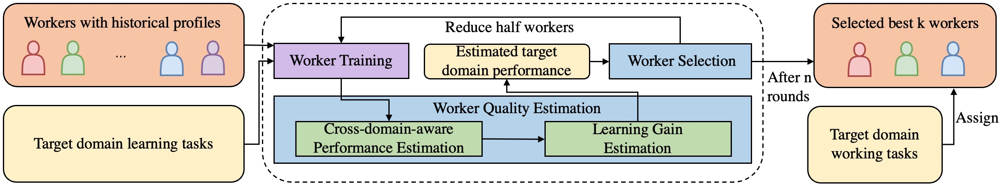

# Cross-domain-aware Worker Selection with Training
This is the repository for the code and data of paper: [Cross-domain-aware Worker Selection with Training for Crowdsourced Annotation](https://arxiv.org/pdf/2406.06977):




## Settings
Intel Xeon Gold 6240 CPU @ 2.60GHz

Python version 3.8

## Install
```console
$ git clone [link to repo]
$ cd C4U-paper
$ pip install -r requirements.txt 
```

If you are using Anaconda, you can create a virtual environment and install all the packages:

```console
$ conda create --name C4U python=3.8
$ conda activate C4U
$ pip install -r requirements.txt
```

## Reproduce the results
In order to reproduce the results on the real-world dataset, please run the following code:
```console
$ python real-exp.py >> ./real_result.txt
```

## Surveys
In order to help readers better understand our work, we provide the pdf version of the surveys we conducted in these [link_for_RW1](https://drive.google.com/file/d/1NHE-16oJWTvWNQBe8UKNrWsIcHsv8D1h/view?usp=sharing) and [link_for_RW2](https://drive.google.com/file/d/1pL1Oi4DqgFJVUg0ZWJtmcLmc7Er77rIK/view?usp=drive_link).

[Survey entrance for RW-1](https://ust.az1.qualtrics.com/jfe/form/SV_56GLJc7JJZkcyUu).

[Survey entrance for RW-2](https://ust.az1.qualtrics.com/jfe/form/SV_cI7YTQY7SUrv0j4).

[RW-1 data](https://github.com/for-double-blind/C4U-paper/blob/main/data/real_data.csv).

[RW-2 data](https://github.com/for-double-blind/C4U-paper/blob/main/data/real_data_2.csv).

## Examples
We provide exemplar images from our survey to give the readers a quick view of the different domains.
### RW-1
African Elephant, color and shape: [positive](https://github.com/for-double-blind/C4U-paper/blob/main/figures/examples/african.png), [negative](https://github.com/for-double-blind/C4U-paper/blob/main/figures/examples/asian.png).

Clownfish, color and shape: [positive](https://github.com/for-double-blind/C4U-paper/blob/main/figures/examples/clown.png), [negative](https://github.com/for-double-blind/C4U-paper/blob/main/figures/examples/clown-negative.png).

Boeing 737, size: [positive](https://github.com/for-double-blind/C4U-paper/blob/main/figures/examples/737-1.png), [negative](https://github.com/for-double-blind/C4U-paper/blob/main/figures/examples/777.png).

Petunia, color and shape [positive](https://github.com/for-double-blind/C4U-paper/blob/main/figures/examples/petunia.png), [negative](https://github.com/for-double-blind/C4U-paper/blob/main/figures/examples/petunia-negative.png).
### RW-2
Peruvian lily, color: [positive](https://github.com/for-double-blind/C4U-paper/blob/main/figures/examples/peruvian.jpg), [negative](https://github.com/for-double-blind/C4U-paper/blob/main/figures/examples/desert.jpg).

Red fox, shape: [positive](https://github.com/for-double-blind/C4U-paper/blob/main/figures/examples/fox.JPEG), [negative](https://github.com/for-double-blind/C4U-paper/blob/main/figures/examples/lesser_panda.JPEG).

English marigold, shape: [positive](https://github.com/for-double-blind/C4U-paper/blob/main/figures/examples/english.jpg), [negative](https://github.com/for-double-blind/C4U-paper/blob/main/figures/examples/susan.jpg).

Lenten rose, shape: [positive](https://github.com/for-double-blind/C4U-paper/blob/main/figures/examples/lenten.jpg), [negative](https://github.com/for-double-blind/C4U-paper/blob/main/figures/examples/columbien.jpg).
